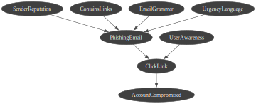

# :globe_with_meridians: NOTES -  Build a Bayesian Network in pyAgrum

## Network Structure
The Bayesian Network consists of eight nodes representing email characteristics, user behavior, and the final security outcome. The structure models a simplified phishing attack pipeline, where email features influence whether an email is classified as phishing, which in turn affects user interaction and eventual account compromise.

The causal structure follows a directed acyclic graph (DAG) representing the phishing process:
- Email features (SenderReputation, EmailGrammar, ContainsLinks, UrgencyLanguage) influence the probability of a phishing email.
- The variable PhishingEmail and the user's cybersecurity awareness jointly influence whether a user clicks a malicious link.
- AccountCompromised depends on whether a malicious link has been clicked.

A visual representation of the network structure is shown below:

## Variable Descriptions
The Bayesian Network consists of the following binary variables:
- **SenderReputation**:  Represents whether the sender appears trustworthy or suspicious. Suspicious senders are more commonly associated with phishing attempts.
- **EmailGrammar**:  Indicates the quality of grammar and spelling in the email. Poor grammar is often an indicator of phishing emails.
- **ContainsLinks**:  Indicates whether the email contains embedded hyperlinks. Phishing emails frequently include malicious links.
- **UrgencyLanguage**:  Represents whether the email contains urgent or threatening language designed to pressure the recipient into immediate action.
- **PhishingEmail**:  The central classification variable indicating whether an email is phishing or legitimate, based on observed email characteristics.
- **UserAwareness**:  Represents the cybersecurity awareness level of the user. Users with higher awareness are generally less susceptible to phishing attempts.
- **ClickLink**:  Indicates whether the user clicks on a link contained in the email. This depends on both email characteristics and user awareness.
- **AccountCompromised**:  Represents whether the user's account becomes compromised as a result of interacting with a malicious link.

## CPTs
### SenderReputation
> Most emails are not phishing emails 

| P(SenderReputation) |  |
| :--- | :---: |
| good | 0.80 |
| suspicious | 0.20 |

### EmailGrammar
> Phishing emails are more likely to contain grammatical error

| P(EmailGrammar) |  |
| :--- | :---: |
| good | 0.85 |
| poor | 0.15 |

### ContainsLinks
> A lot of emails already contain links (also the legit ones)

| P(ContainsLinks) |  |
| :--- | :---: |
| yes | 0.60 |
| no | 0.40 |

### UrgencyLanguage
> Urgency is a typical phishing-signal, but this is not always present

| P(UrgencyLanguage) |  |
| :--- | :---: |
| yes | 0.30 |
| no | 0.70 |

### PhishingEmail
| SenderReputation | EmailGrammar | ContainsLinks | UrgencyLanguage | P(PhishingEmail=yes) |
| :--- | :--- | :--- | :--- | :---: |
| good | good | no | no | 0.01 |
| good | good | no | yes | 0.05 |
| good | good | yes | no | 0.10 |
| good | good | yes | yes | 0.25 |
| good | poor | no | no | 0.05 |
| good | poor | no | yes | 0.15 |
| good | poor | yes | no | 0.25 |
| good | poor | yes | yes | 0.45 |
| suspicious | good | no | no | 0.20 |
| suspicious | good | no | yes | 0.40 |
| suspicious | good | yes | no | 0.55 |
| suspicious | good | yes | yes | 0.75 |
| suspicious | poor | no | no | 0.50 |
| suspicious | poor | no | yes | 0.70 |
| suspicious | poor | yes | no | 0.80 |
| suspicious | poor | yes | yes | 0.95 |

### UserAwareness
| P(UserAwareness) |  |
| :--- | :---: |
| high | 0.60 |
| low | 0.40 |

### ClickLink
| PhishingEmail | UserAwareness | P(ClickLink=yes) |
| :--- | :--- | :---: |
| yes | low | 0.90 |
| yes | high | 0.60 |
| no | low | 0.30 |
| no | high | 0.05 |

### AccountCompromised
| ClickLink | P(AccountCompromised=yes) |
| :--- | :---: |
| yes | 0.70 |
| no | 0.01 |

## Validation Results
Several inference experiments were conducted to verify the behavior of the Bayesian Network.

| # | Experiment | Result |
| :---: | :--- | :---: |
| 1 | Prior phishing probability | 19.31% |
| 2 | Suspicious sender | 50.92% |
| 3 | All phishing indicators present | 95% |
| 4.1 | Click probability (high awareness) | 60% |
| 4.2 | Click probability (low awareness) | 90% |
| 5 | Account compromise (high-risk scenario) | 61.03% |

The results demonstrate that the model behaves consistently with the intended phishing attack process. Suspicious email characteristics substantially increase the probability that an email is classified as phishing, while user awareness strongly influences click behavior. The resulting risk propagates through the network and ultimately affects the probability of account compromise.
